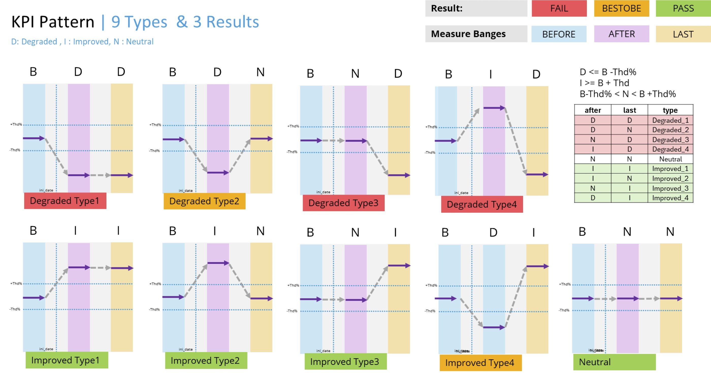

# RAN Quality Evaluator – Web System Specification (Draft)

## 1. System Overview and Objectives
- **Purpose**: Implement a web system to evaluate RAN quality at a site level using compound quality indicators (CQIs), traffic metrics, and temporal cell change analysis. The system evaluates KPI patterns around a user-provided input date and generates site and neighbor analyses, visualizations, and a report.
- **Primary reference**: `RFP RAN Quality Evaluator V1.docx` (converted to `rfp_ran_quality_evaluator_v1.txt`).

## 2. RFP Requirements Extract
- **Evaluation Result**: Pass (all KPI Patterns Pass), Fail (≥1 KPI Pattern Fail), Restored (≥1 KPI Pattern Restored and others Pass).
- **KPI Pattern Result Types**: Pass, Fail, Restored.
- **KPI Pattern Type**: 9 possible KPI Pattern Types (detailed definitions to be finalized with stakeholders).
- **Settings**:
  - `threshold`: 5%
  - `period`: 7 days
  - `guard`: 7 days
- **Measure Ranges**:
  - Before: [input_date – guard – period; input_date – guard]
  - After: [input_date + guard; input_date + guard + period]
  - Last: [max_date – period; max_date]
- **Indicators**:
  - Site CQIs: `umts_cqi`, `lte_cqi`, `nr_cqi`
  - Site traffic data: `3G_PS + 4G_PS + 5G_PS`
  - Site traffic voice: `3G_CS + VoLTE`
  - Neighbor CQIs: `umts_cqi`, `lte_cqi`, `nr_cqi`
  - Neighbor traffic data: `3G_PS + 4G_PS + 5G_PS`
  - Neighbor traffic voice: `3G_CS + VoLTE`
- **User inputs**: `site_att`, `input_date`
- **Visualizations**:
  - Plot01: Site CQIs (line) over [input_date – 30; max_date] with vertical limits for Before/After/Last
  - Plot02: Site traffic data (stacked bar) with vertical limits
  - Plot03: Site traffic voice (stacked bar) with vertical limits
  - Plot04: Geo map (site green; neighbors yellow)
  - Plot05: Neighbor CQIs (line) with vertical limits
  - Plot06: Neighbor traffic data (stacked bar) with vertical limits
  - Plot07: Neighbor traffic voice (stacked bar) with vertical limits
- **Deliverable**: Report with all results in PDF.

## 3. Data Model and Sources
Environment variables from `.env` in `quality_assurance_code/` and `cell_change_evolution/`:
- `ROOT_DIRECTORY`, `POSTGRES_USERNAME`, `POSTGRES_PASSWORD`, `POSTGRES_HOST`, `POSTGRES_PORT`, `POSTGRES_DB`.

### 3.1 Master Data and Technology-Specific Tables
Defined in `quality_assurance_code/`:
- `create_db_quality.py`:
  - Master tables: `master_cell_total`, `master_node_total`, `ept_cell`, `master_cell`, `master_node`, and related helpers.
- `create_db_umts_cqi.py`:
  - `umts_cqi_daily`, `umts_cell_traffic_daily`.
- `create_db_lte_cqi.py`:
  - `lte_cqi_daily`, `lte_cell_traffic_daily`, `lte_cqi_metrics`, `new_cell_expansion`, `att_site_init_date_count`, `lte_cqi_vendor_daily`.
- `create_db_nr_cqi.py`:
  - `nr_cqi_daily`.
- `create_db_volte_cqi.py`:
  - `volte_cqi_vendor_daily`, `volte_cqi_metrics_weekly`.

CSV ingestion (selected):
- `insert_db_master_cell.py`: populates master cell/node tables from CSVs and `freq_band.csv`.
- `insert_db_umts_cqi.py` and `insert_db_umts_cell_traffic.py`: UMTS CQI and traffic.
- `insert_db_lte_cqi.py` and `insert_db_lte_cell_traffic.py`: LTE CQI and traffic.
- `insert_db_nr_cqi.py`: NR/5G CQI.
- `insert_db_volte_cqi.py`: VoLTE vendor CQI and metrics.

### 3.2 Cell Change Evolution Tables and Purpose
Defined in `cell_change_evolution/`:
- `create_db_cell_change.py`:
  - `lte_cell_traffic_period(cell, vendor, init_date, end_date, period)` primary key `(cell, vendor, init_date)`.
  - `umts_cell_traffic_period(cell, vendor, init_date, end_date, period)` primary key `(cell, vendor, init_date)`.
  - `umts_cell_change_event(region, province, municipality, att_name, date, add_cell, delete_cell, total_cell, remark, b2/b4/b5/x_*3g buckets...)` PK `(region, province, municipality, att_name, date)`.
  - `lte_cell_change_event(region, province, municipality, att_name, date, add_cell, delete_cell, total_cell, remark, b2/b4/b5/b7/b26/b42/x_*4g buckets...)` PK `(region, province, municipality, att_name, date)`.
- Purpose: detect and persist traffic-active periods for each cell and aggregate daily site-level cell adds/deletes by band/vendor to support KPI context and input date recommendations.

### 3.3 CSV Field Mappings (Extracted from ingestion scripts)
This section captures the exact CSV-to-DB mappings used by the loaders. Source scripts are under `quality_assurance_code/`.

- __UMTS CQI site daily (`insert_db_umts_cqi.py` → table `umts_cqi_daily`)__
  - Keys: `DATE→date`, `REGION→region`, `PROVINCE→province`, `MUNICIPALITY→municipality`, `CITY→city`, `SITE_ATT→site_att`, `VENDORS→vendors`, `3G Composite Quality→umts_composite_quality`.
  - Huawei KPIs: `H3G:RRC_SUCCESS_CS→h3g_rrc_success_cs`, `H3G:RRC_ATTEMPTS_CS→h3g_rrc_attempts_cs`, `H3G:NAS_SUCCESS_CS→h3g_nas_success_cs`, `H3G:NAS_ATTEMPTS_CS→h3g_nas_attempts_cs`, `H3G:RAB_SUCCESS_CS→h3g_rab_success_cs`, `H3G:RAB_ATTEMPTS_CS→h3g_rab_attempts_cs`, `H3G:DROP_NUM_CS→h3g_drop_num_cs`, `H3G:DROP_DENOM_CS→h3g_drop_denom_cs`, `H3G:RRC_SUCCESS_PS→h3g_rrc_success_ps`, `H3G:RRC_ATTEMPTS_PS→h3g_rrc_attempts_ps`, `H3G:NAS_SUCCESS_PS→h3g_nas_success_ps`, `H3G:NAS_ATTEMPTS_PS→h3g_nas_attempts_ps`, `H3G:RAB_SUCCESS_PS→h3g_rab_success_ps`, `H3G:RAB_ATTEMPTS_PS→h3g_rab_attempts_ps`, `H3G:PS_RETAINABILITY_NUM→h3g_ps_retainability_num`, `H3G:PS_RETAINABILITY_DENOM→h3g_ps_retainability_denom`, `H3G:THPT_USER_DL_KBPS_NUM→h3g_thpt_user_dl_kbps_num`, `H3G:THPT_USER_DL_KBPS_DENOM→h3g_thpt_user_dl_kbps_denom`.
  - Ericsson KPIs: `E3G:*` mapped analogously to `e3g_*` (success/attempts/drop/retain/thpt num/denom for CS/PS).
  - Nokia KPIs: `N3G:*` mapped analogously to `n3g_*`.
  - Aggregates: `Accessibility CS→accessibility_cs`, `Acc CS failures→acc_cs_failures`, `Retainability CS→retainability_cs`, `Ret CS failures→ret_cs_failures`, `Accessibility PS→accessibility_ps`, `Acc PS failures→acc_ps_failures`, `Retainability PS→retainability_ps`, `Ret PS failures→ret_ps_failures`, `Traffic Voice→traffic_voice`, `Throughput DL→throughput_dl`, `Thpt failures→thpt_failures`, `PS GB (UL+DL)→ps_gb_uldl`, and per-vendor traffic: `H3G/E3G/N3G:TRAFFIC_V_USER_CS`, `H3G/E3G/N3G:TRAFFIC_D_USER_PS_GB` → `h3g/e3g/n3g_*`.
  - Loader behavior: parse dates, filter `date > last_date`, drop duplicates on `(date, site_att, vendors)`.

- __LTE CQI site daily (`insert_db_lte_cqi.py` → table `lte_cqi_daily`)__
  - Keys: `DATE→date`, `REGION→region`, `PROVINCE→province`, `MUNICIPALITY→municipality`, `CITY→city`, `SITE_ATT→site_att`, `VENDORS→vendors`, `4G Composite Quality→f4g_composite_quality`.
  - Vendor blocks: `H4G:*→h4g_*`, `S4G:*→s4g_*`, `E4G:*→e4g_*`, `N4G:*→n4g_*` including `RRC_SUCCESS_ALL`, `RRC_ATTEMPS_ALL`, `S1_SUCCESS`, `S1_ATTEMPS`, `ERAB_SUCCESS`, `ERABS_ATTEMPS`, `RETAINABILITY_NUM/DENOM`, `IRAT_4G_TO_3G_EVENTS`, `ERAB_SUCC_ESTABLISHED`, `THPT_USER_DL_KBPS_NUM/DENOM`, `TIME3G/TIME4G`, `SUMAVG_LATENCY`, `SUMAVG_DL_KBPS`, `SUMMUESTRAS`.
  - Aggregates: `Accessibility PS→accessibility_ps`, `Acc failures→acc_failures`, `Retainability PS→retainability_ps`, `Ret failures→ret_failures`, `IRAT PS→irat_ps`, `IRAT failures→irat_failures`, `ThpT DL kbps (RAN DRB)→thpt_dl_kbps_ran_drb`, `Thpt failures→thpt_failures`, `Ookla Latency→ookla_latency`, `Latency failures→latency_failures`, `Ookla thp→ookla_thp`, `Thpt Ookla failures→thpt_ookla_failures`, `4GON3G→f4gon3g`, `4Gon3G failures→f4gon3g_failures`, `Traffic DL+UL (TB)→traffic_dlul_tb`, and per-vendor traffic GB.
  - Loader behavior: parse dates, filter `date > last_date`, drop duplicates on `(date, site_att, vendors)`.

- __NR/5G CQI site daily (`insert_db_nr_cqi.py` → table `nr_cqi_daily`)__
  - Keys: `DATE→date`, `REGION→region`, `PROVINCE→province`, `MUNICIPALITY→municipality`, `CITY→city`, `SITE_ATT→site_att`, `VENDORS→vendors`, `5G Composite Quality→nr_composite_quality`.
  - Ericsson `E5G:*→e5g_*` and Nokia `N5G:*→n5g_*` metrics: `ACC_RRC_*`, `S1_SR_*`, `NSA_ACC_ERAB_*`, `NSA_RET_ERAB_*` (drop/att), throughput averages `NSA_THPT_MAC_DL_AVG_MBPS_*` as `*_num/_denom`.
  - Aggregates: `Acc MN→acc_mn`, `Acc SN→acc_sn`, `ENDC Ret Tot→endc_ret_tot`, `Ret MN→ret_mn`, `Thp MN→thp_mn`, `Thp SN→thp_sn`, traffic legs `Traffic 4GLeg GB/5GLeg GB/MAC GB` plus per-vendor PDCP/MAC traffic fields.
  - Loader behavior: parse dates, filter `date > last_date`, drop duplicates on `(date, site_att, vendors)`.

- __VoLTE CQI vendor daily (`insert_db_volte_cqi.py` → table `volte_cqi_vendor_daily`)__
  - Common keys per vendor CSV: `DATE→date`, `REGION→region`, `PROVINCE→province`, `MUNICIPALITY→municipality`, `SITE_ATT→site_att`.
  - Ericsson: `VOLTE_CQI→volte_cqi_e`, `ACC_VOLTE→acc_volte_e`, `VOLTE_ERAB_CALL_DROP_RATE_QCI1→erab_drop_qci1_e`, `VOLTE_ERAB_CALL_DROP_RATE_QCI5→erab_drop_qci5_e`, `SRVCC_RATE→srvcc_rate_e`, `USER_TRAFFIC_VOLTE→user_traffic_volte_e`.
  - Huawei: same KPI names mapped to `*_h` suffix. Nokia `*_n`. Samsung `*_s`.
  - Loader behavior: per-vendor DataFrames filtered by `date > last_date`, then outer-merged on `(date, region, province, municipality, site_att)` and bulk-inserted.

- __UMTS cell traffic daily (`insert_db_umts_cell_traffic.py` → table `umts_cell_traffic_daily`)__
  - Columns: `DATE→date`, `RNC→rnc`, `CELL→cell`, `TRAFFIC_V_USER_CS→traffic_v_user_cs`, `TRAFFIC_D_USER_PS_GB→traffic_d_user_ps_gb`, plus `VENDOR→vendor` injected by loader.
  - Vendors: `huawei`, `ericsson`, `nokia` (normalized to same schema). Filter `date > last_date`, dedupe on `(date, cell, vendor)`.

- __LTE cell traffic daily (`insert_db_lte_cell_traffic.py` → table `lte_cell_traffic_daily`)__
  - Columns: `DATE→date`, `ENB_AGG→enb_agg`, `CELL→cell`, `TRAFFIC_D_USER_PS_GB→traffic_d_user_ps_gb`, plus `VENDOR→vendor`.
  - Vendors: `ericsson`, `nokia`, `huawei`, `samsung` (same schema). Filter `date > last_date`, dedupe on `(date, cell, vendor)`.

- __Master cells (`insert_db_master_cell.py` → `master_cell`, `master_node`)__
  - Per-vendor/tech processors: `cell_3gH`, `cell_4gH`, `cell_3gE`, `cell_4gE`, `cell_5gE`, `cell_3gN`, `cell_4gN`, `cell_4gS`, `cell_5gN`.
  - Common output fields include: `node`, `cell`, `region`, `province`, `municipality`, `lat_wgs84`, `long_wgs84`, `rbs_name`, `tac` (hex→dec for Samsung), `cellid`, `azimuth`, `h_beam`, `lac`, `rac`, `uarfcn_dl/earfcn_dl`, `freq_band`, `vendor`, `tech`, derived `band_indicator`, `band_width`, and per-3G `rnc`, `rncid`.
  - Filters: `ACTSTATUS==1`, `UARFCN>0`, `CELL` non-empty (or `MANAGED_OBJECT3` for 5G). Merge with `code/freq_band.csv` to enrich band info.

## 4. Processing Workflows

### 4.1 Data Ingestion
- Run DB creation scripts in `quality_assurance_code/` to initialize schemas.
- Use `insert_db_*` scripts to load CSVs into daily tables.

### 4.2 Cell Traffic Period Detection and Events
- `cell_change_evolution/insert_db_lte_cell_period.py` and `insert_db_umts_cell_period.py`:
  - Detect earliest and latest dates with traffic using SQL window functions with a rule of at least 3 consecutive days to form a period; update `*_cell_traffic_period`.
- `cell_change_evolution/insert_db_lte_cell_change.py` and `insert_db_umts_cell_change.py`:
  - Join traffic period data with `master_cell` to derive cell change events per site/day; create incremental summaries and write to `*_cell_change_event`.

#### 4.2.1 Period detection algorithm (3+ consecutive days)
- __Input tables__: `lte_cell_traffic_daily`, `umts_cell_traffic_daily` with `(date, cell, vendor, traffic)`.
- __Core idea__: mark days with traffic, compute island segments of consecutive dates per `(cell, vendor)` using window functions, then keep segments with length ≥ 3.
- __Representative SQL pattern__:
  - Partition by `(cell, vendor)`, order by `date`.
  - Use `ROW_NUMBER()` and `DATE_TRUNC`/`LAG` or `date - ROW_NUMBER()` trick to assign a group key per consecutive run.
  - `MIN(date)` → `init_date`, `MAX(date)` → `end_date`, `COUNT(*)` → `period` per run.
- __Persistence__: upsert into `*_cell_traffic_period(cell, vendor, init_date, end_date, period)`; truncate-then-insert on full rebuild.
- __Outcome__: normalized time intervals per cell describing when the cell was traffic-active.

#### 4.2.2 Daily cell-change events aggregation
- __Inputs__:
  - Period tables `*_cell_traffic_period` joined with `master_cell_total` to get geography (`region/province/municipality/att_name`), technology, vendor, and `band_indicator`.
  - A calendar expanded across all relevant days in each period.
- __Compute__:
  - For each day and site (`att_name`), count cells by band and vendor; compare against prior day to derive `add_cell`, `delete_cell`, and `total_cell`.
  - Populate vendor-band buckets: e.g., LTE `b2_h4g`, `b4_e4g`, `b7_n4g`, `b26_s4g`, `b42_*`; UMTS `b2_*3g`, `b4_*3g`, `b5_*3g`, and `x_*` for uncategorized.
  - Build cumulative/running totals per day to facilitate stacked-bar visualizations and summaries.
- __Persistence__:
  - Insert rows into `lte_cell_change_event` / `umts_cell_change_event` keyed by `(region, province, municipality, att_name, date)` with counts and a `remark` field.
  - Maintain `created_at` for audit.
- __Outputs used by UI/API__:
  - `select_db_cell_period.get_cell_change_data_grouped()` returns grouped frames by `network`/`region`/`province`/`municipality` with per-band-vendor columns and `total_cell_{lte,umts}`.
  - `expand_dates()` fills date gaps with zeroes to ensure continuous timelines for plotting.

### 4.3 CQI and Traffic Data Selection Utilities
- `cell_change_evolution/select_db_cqi_daily.py`:
  - Query site-level UMTS/LTE/NR CQIs and traffic (data and voice) over ranges.
- `cell_change_evolution/select_db_neighbor_cqi_daily.py`, `select_db_master_node.py`, `select_db_cell_period.py`:
  - Retrieve neighbor lists and aggregate neighbor CQIs/traffic; fetch traffic periods to surface cell quantity variations.

### 4.4 Reporting Helpers
- `cell_change_evolution/report_processor.py`:
  - Export DataFrames to CSV/Excel and generate text summaries; supports compiling outputs for PDF.
- `cell_change_evolution/plot_processor.py` and `gui_processor*.py`:
  - Generate plots as per RFP and support prototype GUI behavior.

## 5. CQI Formulas and Mapping
- Source: `cqiformulas`.
- UMTS (3G):
  - `0.25*EXP((1-AccCS%I)*-58.1178) + 0.25*EXP((1-RetCs%)*-58.1178) + 0.15*EXP((1-PS ACC)*-28.6202) + 0.15*EXP((1-PS RETI)*-28.6202) + 0.20*(1-EXP(THP DL*-0.00094856))`
- LTE (4G):
  - `0.25*EXP((1-ACC LTE)*-63.9167) + 0.25*EXP((1-RET LTE)*-63.9167) + 0.05*EXP((IRAT LTE)*-22.3144) + 0.30*(1-EXP(THP DL*-0.000282742)) + 0.05*MIN(1,EXP((4gon3g -10%)*-1.15718)) + 0.05*EXP((Ookla Latency-20)*-0.0052680) + 0.05*(1-EXP(Ookla Thp*-0.0000536479))`
- NR (5G):
  - `0.17*EXP((1-Acc Mn)*C1) + W2*EXP((1-Acc SN)*C2) + W3*EXP((1-Ret MN)*C3) + W4*EXP((1-Endc Ret Tot)*C4) + W5*(1-EXP(Thp MN*1000*C5)) + W6*(1-EXP(Thp SN*1000*C6))`
- Mapping to DB:
  - Inputs are present in daily CQI/traffic tables: `umts_cqi_daily`, `lte_cqi_daily`, `nr_cqi_daily`, `volte_cqi_vendor_daily`, `*_cell_traffic_daily` (see create_db scripts above for available columns). Exact column-to-formula mapping to be finalized per KPI naming conventions in the ingestion scripts.

## 6. KPI Pattern Evaluation Logic (Spec)
- Compute averages over the three ranges (Before, After, Last) for each of:
  - Site CQIs (UMTS, LTE, NR)
  - Site traffic data and voice
  - Neighbor CQIs and traffic (data and voice; aggregated by neighbor list)
- Compute variation: e.g., `delta_after = (After - Before) / max(|Before|, eps)`, `delta_restore = (Last - After) / max(|After|, eps)`.
- Apply `threshold` (default 5%) to classify each metric into the 9 KPI Pattern Types (to be detailed).
- Derive overall KPI Pattern Result per metric: Pass / Fail / Restored.
- Roll up to Evaluation Result across metrics as per RFP rules.

### 6.1 KPI Pattern Types and Classification
- __Change states (per metric)__:
  - Increase: `delta >= +threshold`
  - Decrease: `delta <= -threshold`
  - Stable: `|delta| < threshold`
- __9 KPI Pattern Types (Before→After vs After→Last)__:
  - T1: Increase then Increase
  - T2: Increase then Stable
  - T3: Increase then Decrease
  - T4: Stable then Increase
  - T5: Stable then Stable
  - T6: Stable then Decrease
  - T7: Decrease then Increase
  - T8: Decrease then Stable
  - T9: Decrease then Decrease
- __Pattern Result per metric__:
  - Pass: No material degradation after the change window, i.e., `(Before→After is not Decrease)` AND `(After→Last is not Decrease)`.
  - Fail: Material degradation persists, i.e., `(Before→After is Decrease)` AND `(After→Last is Stable or Decrease)`.
  - Restored: Degradation after input date but recovered later, i.e., `(Before→After is Decrease)` AND `(After→Last is Increase)`.
- __Roll-up to Evaluation Result__:
  - Pass: all tracked metrics Pass.
  - Restored: at least one metric Restored and all others Pass.
  - Fail: otherwise (any Fail).
- __Notes__:
  - Compute deltas using range means; use `eps > 0` guard to avoid division by zero.
  - Apply logic independently for: site CQIs (UMTS/LTE/NR), site traffic (data, voice), neighbors (CQIs, data, voice). Roll-up can be weighted in future if required.
  - Threshold default is 5%; configurable via POST `/api/evaluate`.

## 7. Proposed Web Architecture
- **Backend**:
  - Python (SQLAlchemy, Pandas).
  - REST API to expose data queries and evaluation endpoints.
  - Batch jobs for ingestion and cell change processing.
- **Database**: PostgreSQL as per `create_db_*.py` schemas.
- **Frontend**:
  - Web UI to select `site_att` and `input_date`, display plots (Plot01–Plot07), and show Evaluation Result.
  - Export PDF report.

### 7.1 API Endpoints (Draft)
- `GET /api/sites/{site_att}/ranges?input_date=YYYY-MM-DD` → computed ranges and max_date.
- `GET /api/sites/{site_att}/cqi?from=YYYY-MM-DD&to=YYYY-MM-DD` → UMTS/LTE/NR CQIs.
- `GET /api/sites/{site_att}/traffic?from=YYYY-MM-DD&to=YYYY-MM-DD&type=data|voice`.
- `GET /api/sites/{site_att}/neighbors` → neighbor list and geo coords.
- `GET /api/sites/{site_att}/neighbors/aggregates?from=...&to=...` → neighbor CQIs/traffic aggregates.
- `GET /api/sites/{site_att}/cell-changes` → dates with cell qty variation (3G, 4G) and recommendation.
- `POST /api/evaluate` → body: `{site_att, input_date, threshold, period, guard}`; returns KPI Pattern Types/Results and Evaluation Result.
- `POST /api/report` → body: `{site_att, input_date, ...}`; returns PDF.

### 7.2 UI Prototypes (Shiny for Python)
- __Files__: `cell_change_evolution/gui_processor.py`, `gui_processor_2.py`, `gui_processor_3.py`.
- __Purpose__: interactive prototypes for cell-change stacks, site CQIs, data/voice traffic, and neighbor aggregates.
- __Key behaviors__:
  - Dynamic filters for technology (3G/4G/5G), vendor, geography, date ranges (`get_max_date()` from `select_db_master_node.py`).
  - Uses `get_cell_change_data_grouped()` and `expand_dates()` to feed `plot_processor.plot_cell_change_data()`.
  - Site/neighbor charts via `select_db_cqi_daily.py` and `select_db_neighbor_cqi_daily.py` rendered through `plot_processor.py`.
- __Local run hints__: each script defines a different port (e.g., 8081/8082/8083) when executed directly.

## 8. UI/UX Requirements
- **Inputs**: `site_att` selector with search, `input_date` picker; optional overrides: threshold, period, guard.
- **Visualizations**:
  - Line and stacked bar plots with vertical dotted lines for Before/After/Last bounds.
  - Map with site (green) and neighbors (yellow).
- **Details**: Hover tooltips, legend, export to CSV/Excel for underlying data.
- **Report**: One-click PDF generation including all plots and summary tables.

### 8.1 RFP Figures (placeholders)
- __Figure A__: High-level system overview
  - 
- __Figure B__: KPI pattern evaluation timeline
  - 

## 9. Operational Workflows
- **Initial load**: Run `create_db_*.py` scripts then `insert_db_*.py` loaders.
- **Daily/Weekly refresh**: Re-run ingestion; then run `insert_db_*_cell_period.py` and `insert_db_*_cell_change.py` to maintain period and event tables.
- **Data QC**: Monitor unique constraints and nullability as defined in schemas; use `truncate_table()`/`delete_*()` utilities if needed (see `create_db_cell_change.py`).

## 10. Non-Functional Requirements
- **Performance**: Pre-aggregate with SQL where possible; paginate API responses.
- **Reliability**: Idempotent batch jobs; transactional inserts.
- **Security**: Credentials via environment variables; read-only roles for API queries.
- **Auditability**: `created_at` timestamps on period/event tables; maintain CSV export archives.

## 11. Open Items / Assumptions
- Define the 9 KPI Pattern Types precisely and the roll-up logic across multiple metrics.
- Confirm exact column mapping for CQI formulas to DB fields per technology.
- Neighbor derivation logic and geo source to be validated against `master_node` and related tables.
- PDF assembly mechanism: confirm library/formatting (e.g., WeasyPrint, ReportLab, or matplotlib + wkhtmltopdf).

## 12. Traceability to Code
- Schemas: `quality_assurance_code/create_db_*.py` and `cell_change_evolution/create_db_cell_change.py`.
- Ingestion: `quality_assurance_code/insert_db_*.py`.
- Period detection: `cell_change_evolution/insert_db_*_cell_period.py`.
- Event aggregation: `cell_change_evolution/insert_db_*_cell_change.py`.
- Data selection: `cell_change_evolution/select_db_*.py`.
- Reporting/plots: `cell_change_evolution/report_processor.py`, `plot_processor.py`.

---
This draft integrates RFP requirements with the existing codebase structure and proposes a concrete web system design. Pending items will be resolved with stakeholder input and field-level mapping from ingestion scripts.
